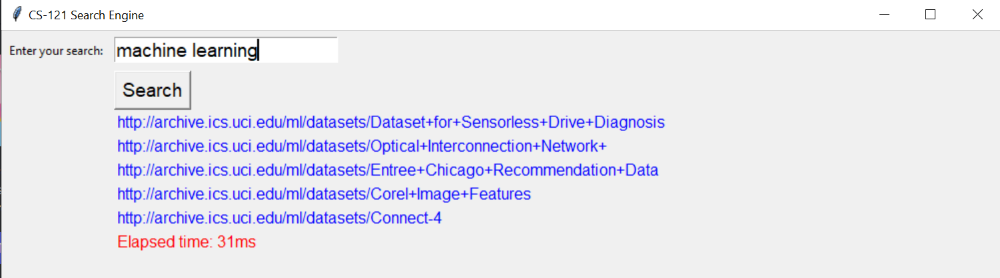

# CS-121 Search-Engine

## Summary
This Search engine does the following things in order:
<ul>
    <li>It takes a corpus of json files and extract the html content from them.
    <li>The html contents are parsed to create tokens which are then stemmed.
    <li>A merged index file is created on the disk with the tokens as keys and postings as values. A posting is in the tuple format (documentID, frequency) where documentID is the id of the document where the token appeared and the token frequency is the number of times the token appears.
    <li>A document id file is also created to help return the urls of the search results.
    <li>For searching, the user will be prompted to enter a search term.
    <li>The search will then return a top 5 urls that matches the search terms.
    <li>Searches will continue until ther user enter -1.
</ul>

## Dependencies
<ol>
    <li>NLTK - installed via <code>pip install --user -U nltk</code></li>
        <ul>
            <li>NLTK is short for Natural Language Tool Kits which needss to be installed to be able to use its PorterStemmer function.</li>
        </ul>
    <li>Beautiful Soup - installed via <code>pip install --user -U beautifulsoup4</code></li>
        <ul>
            <li>Beautiful Soup is used for parsing HTML content extrated from the json files.</li>
        </ul>
</ol>

## How to run
<ul>
    <li>Place all json files that you want to include in the corpus in a folder called DEV.
    <li>Run <code>create_index.py</code> to create the index file. The index.txt will appear in the current directory.
    <li>Run <code>idURL.py</code> to create the document ids file. The documentIDs.txt will appear in the current directory.
    <li>Run <code>start_query.py</code> to start the search. A GUI will appear for the user to do the searches.
</ul>

